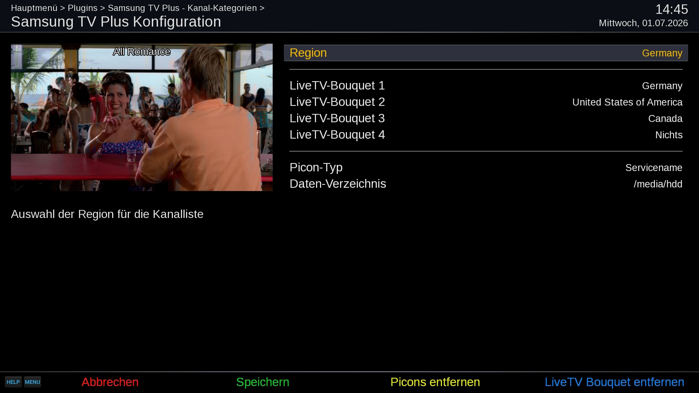

# Samsung TV Plus (STV)
Open-Enigma2 plugin for Live-TV streams

## Live-TV

## Configuration

## Video-On-Demand
Samsung TV Plus does not provide Video-On-Demand.

## Features
- Playback of Samsung TV Plus channels by country
- Live TV bouquet creation with EPG support
- Picon (channel icon) management

## Supported Regions
- Austria (AT)
- Canada (CA)
- Switzerland (CH)
- Germany (DE)
- Spain (ES)
- France (FR)
- United Kingdom (GB)
- India (IN)
- Italy (IT)
- South Korea (KR)
- United States (US)

## Disclaimer
The project author is not responsible for how this software is used by others. It is not intended to be used for accessing or distributing copyrighted materials without authorization.
Users are solely responsible for determining the legality of their actions.

This repository has no control over the streams, links, or the legality of the content provided by the different hosts (including all mirror sites). It is the end user's responsibility to ensure the legal use of these streams, and we strongly recommend verifying that the content complies with all applicable laws, including copyright laws and regulations of your country's jurisdiction before use.

## Limitations
- Samsung TV Plus supports OpenViX and compatible distributions.

## Links
- Installation: https://opencockpit.github.io/SamsungTVCockpit
